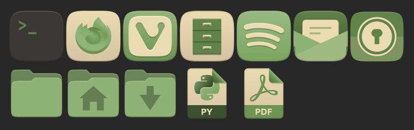

# Gruvbox Plus — Green variant

A fork of [**SylEleuth/gruvbox-plus-icon-pack**](https://github.com/SylEleuth/gruvbox-plus-icon-pack)
that adds a third theme, **Gruvbox Plus Green** — a near-neutral recolor with
green accents. The Gruvbox warm neutrals (backgrounds, shadows, cream
foregrounds) are kept; every saturated accent hue is collapsed onto one muted
green ramp derived from `#748e63`, with per-colour lightness preserved so shapes
stay legible. One icon, Firefox, gets a cream squircle so its green fox stands out.



> This file is the fork's landing page. The upstream project's full documentation
> — installation of the Dark/Light themes, folder-colour switching, credits and
> license — lives in the untouched [`README.md`](../README.md) at the repo root.

## How the variant is generated

The green theme is **generated from `Gruvbox-Plus-Dark`**, not hand-edited, by a
single deterministic script:

```sh
python3 scripts/recolor-green      # Gruvbox-Plus-Dark -> Gruvbox-Plus-Green
```

It copies the Dark theme, remaps every colour token across all categories (a
pure hex→hex transform), applies the Firefox cream-squircle tweak, and rebrands
`index.theme`. `Gruvbox-Plus-Dark` and `Gruvbox-Plus-Light` are left pristine so
merges from upstream never conflict.

## Keeping up with upstream

```sh
git fetch upstream && git merge upstream/master # Pull upstream, review
python3 scripts/recolor-green                   # Regenerate the variant
git add Gruvbox-Plus-Green && git commit -m "chore: Regenerate green variant"
git tag v0.0.2 && git push && git push --tags   # Cut a release
```

Pushing a `v*` tag triggers
[`.github/workflows/green-variant-release.yml`](workflows/green-variant-release.yml),
which verifies the committed variant is in sync with the script, **computes the
Nix `fetchFromGitHub` hash for the tag**, and publishes a GitHub Release whose
body is a ready-to-paste NixOS derivation (version + hash). You never compute a
hash by hand. The workflow can also be run manually against an existing tag.

## Installing on NixOS

Grab the `rev`/`hash` from the latest
[release](https://github.com/kore/gruvbox-plus-icon-pack/releases) and add a
derivation to your configuration:

```nix
gruvbox-plus-green = pkgs.stdenvNoCC.mkDerivation {
  pname = "gruvbox-plus-green-icons";
  version = "0.0.1";
  src = pkgs.fetchFromGitHub {
    owner = "kore";
    repo  = "gruvbox-plus-icon-pack";
    rev   = "v0.0.1";
    hash  = "sha256-5AkbvNRrF601IuDQTz/p4lwAReTRbtyQDDFxOAKd17k=";
  };
  dontConfigure = true;
  dontBuild = true;
  installPhase = ''
    mkdir -p $out/share/icons
    cp -r Gruvbox-Plus-Green $out/share/icons/Gruvbox-Plus-Green
  '';
};
```

Add `gruvbox-plus-green` to `environment.systemPackages`, rebuild, then select
**Gruvbox Plus Green** in GNOME Tweaks (or via
`gsettings set org.gnome.desktop.interface icon-theme "Gruvbox-Plus-Green"`).
The variant is self-contained (a full copy of the Dark theme), so it needs
nothing else installed. A reference package expression also lives in
[`nix/gruvbox-plus-green.nix`](../nix/gruvbox-plus-green.nix).

## Credits & license

All original artwork and the Dark/Light themes are by **Syl Eleuth** and
contributors — see the [upstream repository](https://github.com/SylEleuth/gruvbox-plus-icon-pack)
and the root `README.md`. This fork only adds a recolor script and the generated
green variant. Licensed under **GPL-3.0**, same as upstream.
